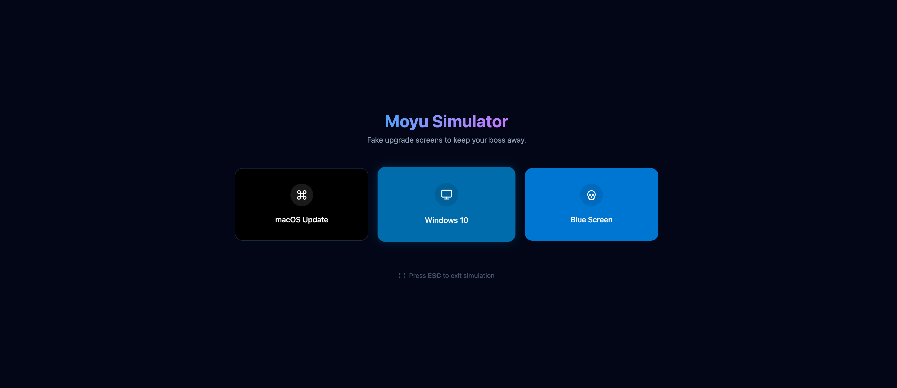
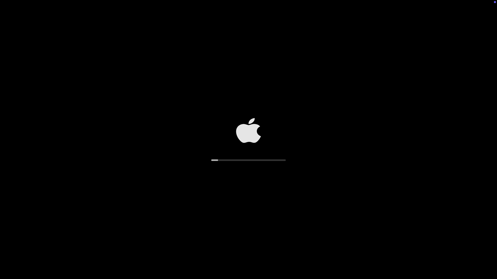
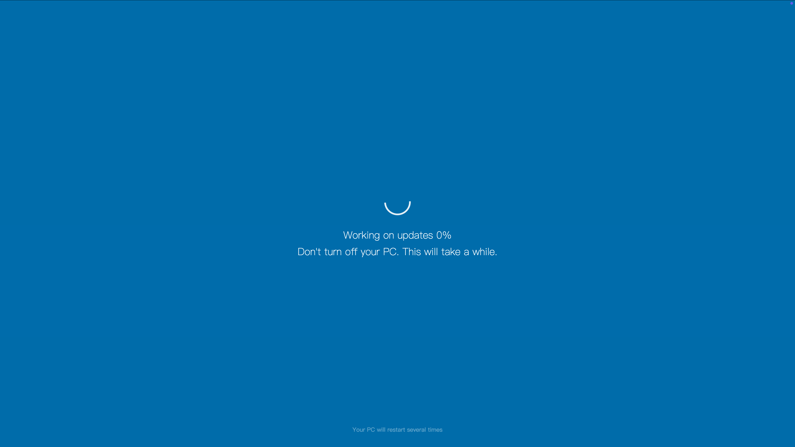
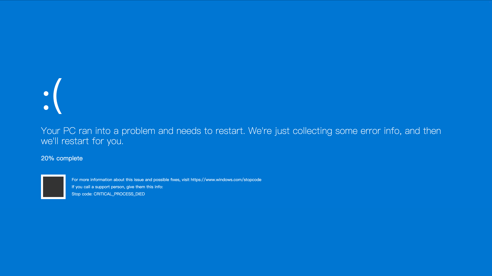

<div align="center">

  # 🎭 Moyu Simulator (摸鱼模拟器)
  
  **Fake System Update Screens for your "Coffee Break".**
  <br>
  **逼真的系统升级画面，让你名正言顺地休息。**

  [](LICENSE)
  
  
  [**🚀 Live Demo / 在线体验**](https://fake-update-screen.vercel.app)
  
  <br>
</div>

---



## 📖 Introduction (简介)

**Moyu Simulator** turns your browser into a realistic system update screen. Whether you use macOS or Windows, just click a button, go full screen, and enjoy your peace of mind while your computer is "updating".

**Moyu Simulator** 把你的浏览器变成逼真的系统升级画面。无论你用 Mac 还是 Windows，只需点一下，立刻全屏，你就可以指着屏幕对老板说：“电脑正在升级，我也没办法🤷‍♂️”。

## ⚡ Features (功能)

### 🍎 macOS Update
Classic Apple logo with a slow-moving progress bar. Perfect for Mac users.


### 🪟 Windows 10 Update
The anxiety-inducing rotating spinner and "Working on updates". The classic freeze.


### 💀 BSOD (Blue Screen)
The legendary "Your PC ran into a problem" screen. For emergency situations.


### 🔒 Immersion Details (沉浸体验)
* **Cursor Hiding**: The mouse cursor automatically disappears for total immersion.
* **Auto Fullscreen**: Enters full screen instantly upon selection.
* **ESC to Exit**: Press `ESC` key to magically fix your computer.

## 📦 Getting Started

1.  Clone the repo
    ```bash
    git clone [https://github.com/yourusername/fake-update-screen.git](https://github.com/yourusername/fake-update-screen.git)
    ```
2.  Install packages
    ```bash
    npm install
    ```
3.  Run
    ```bash
    npm run dev
    ```

## ⚠️ Known Issues / Notes

* **"Press ESC to exit fullscreen" popup**: You might see a browser popup appearing at the top when entering the simulation.
    > **Note**: This is a mandatory security feature enforced by modern browsers (Chrome, Edge, Firefox) to prevent malicious websites from trapping users. **It cannot be disabled via code.**

## ⚠️ Disclaimer

Use responsibly. The author is not responsible for any "fired from job" incidents.
<br>
仅供娱乐，作者不对因使用本工具导致的“被解雇”负责。

---
<div align="center">
  <sub>Built with ❤️ by <a href="https://github.com/xingchengzhu">Xingcheng Zhu</a></sub>
</div>